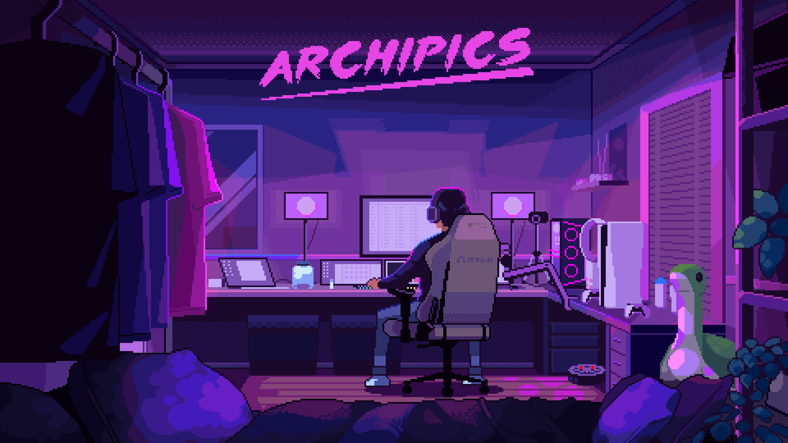
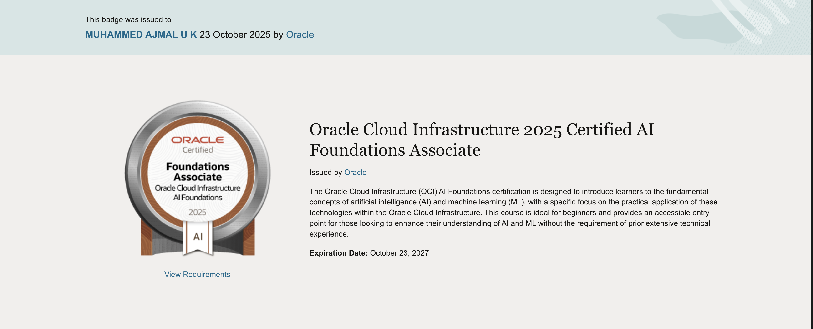
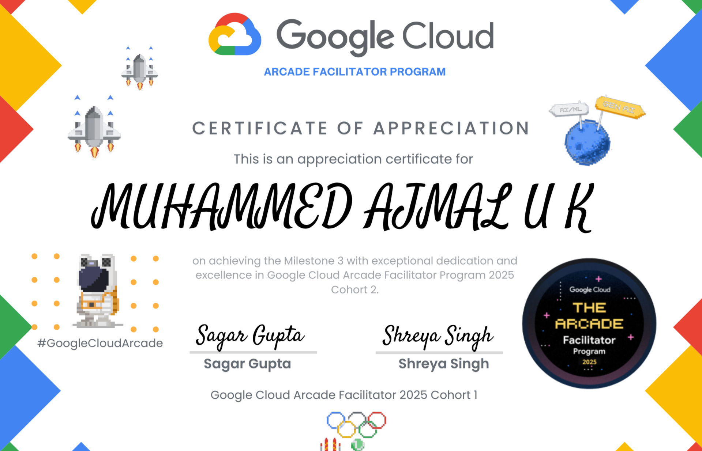

<!-- Banner -->
<p align="center">
  <a href="https://ajmaluk.netlify.app">
    
  </a>
</p>

<h1 align="center">
  
</h1>

<p align="center">
  
</p>

<p align="center">
  <em>Building innovative solutions at the intersection of AI and Full-Stack Development</em>
</p>

---

<!-- Social Badges -->
<p align="center">
  <a href="https://instagram.com/ajmal.me" target="_blank">
    
  </a>
  <a href="https://linkedin.com/in/ajmaluk" target="_blank">
    
  </a>
  <a href="https://x.com/ajmal_uk_" target="_blank">
    
  </a>
  <a href="mailto:ajmaluk.me@gmail.com">
    
  </a>
  <a href="https://ajmaluk.netlify.app" target="_blank">
    
  </a>
</p>

---

<!-- About Section with better layout -->


### 👨‍💻 About Me
```yaml
name: Ajmal UK
located_in: Kerala, India
current_education: MCA @ CET Trivandrum
focus: Full-Stack Development & AI/ML
interests: [Mobile Apps, AI Chatbots, Cloud Architecture]
learning: [LLM Integration, Advanced Flutter, ML Deployment]
fun_fact: I am Iron Man 😎
```

- 🔭 Building **AI-powered mobile & web applications**
- 🌱 Exploring **LLMs, Prompt Engineering & Cloud Solutions**
- 💬 Ask me about **Flutter, Python, Firebase, AI Integration**
- 📫 Reach me: **ajmaluk.me@gmail.com**
- ⚡ Open to **collaborations & internship opportunities**

<br clear="right"/>

---

<!-- Tech Stack - Improved Grid -->
<h2 align="center">🛠️ Tech Stack & Tools</h2>

<div align="center">

### 💻 Languages


### 🎨 Frontend & Mobile


### ⚙️ Backend & APIs


### 🗄️ Databases


### ☁️ Cloud & Deployment


### 🛠️ Tools & Platforms


### 🎨 Design


</div>

---

<!-- Certifications Section -->
<h2 align="center">🎓 Certifications & Achievements</h2>

<p align="center">
  
  
  
  
  
</p>

<div align="center">

| Certification | Issuer | Year |
|--------------|--------|------|
| **Oracle OCI AI Foundations Associate** | Oracle | 2025 |
| **Oracle AI Agent Studio – Foundations** | Oracle | 2025 |
| **Data Analytics Virtual Program** | Deloitte Australia | 2025 |
| **Google Cloud Arcade – Milestone 3** | Google Cloud | 2024 |
| **Prompt Engineering with GitHub Copilot** | Microsoft | 2024 |

</div>

---

<!-- Projects Section -->
<h2 align="center">🚀 Featured Projects</h2>

<table align="center">
  <tr>
    <td width="50%" valign="top">
      <h3 align="center">🧠 Dementia Virtual Memory</h3>
      <p align="center">
        
        
        
      </p>
      <p align="center">AI-powered memory support app with empathetic chatbot, recall assistance, and caregiver analytics dashboard</p>
      <p align="center">
        <a href="https://github.com/ajmal-uk/dementia-virtual-memory" target="_blank">
          
        </a>
      </p>
    </td>
    <td width="50%" valign="top">
      <h3 align="center">✈️ Explore Together</h3>
      <p align="center">
        
        
        
      </p>
      <p align="center">Travel-matching platform connecting solo travelers based on shared interests and destinations</p>
      <p align="center">
        <a href="https://github.com/ajmal-uk/explore-together" target="_blank">
          
        </a>
      </p>
    </td>
  </tr>
  <tr>
    <td width="50%" valign="top">
      <h3 align="center">🏎️ ZyRace</h3>
      <p align="center">
        
        
      </p>
      <p align="center">Physics-based multiplayer racing game with real-time controls and dynamic obstacles</p>
      <p align="center">
        <a href="https://github.com/ajmal-uk/zy-race" target="_blank">
          
        </a>
      </p>
    </td>
    <td width="50%" valign="top">
      <h3 align="center">📧 ZyMail</h3>
      <p align="center">
        
        
      </p>
      <p align="center">Privacy-first temporary email generator with secure API backend</p>
      <p align="center">
        <a href="https://github.com/ajmal-uk/temp-mail-generator" target="_blank">
          
        </a>
      </p>
    </td>
  </tr>
  <tr>
    <td width="50%" valign="top">
      <h3 align="center">🤖 Byte AI</h3>
      <p align="center">
        
        
      </p>
      <p align="center">Privacy-focused AI chatbot for coding and writing assistance without login requirements</p>
      <p align="center">
        <a href="https://github.com/ajmal-uk/byte-ai" target="_blank">
          
        </a>
      </p>
    </td>
    <td width="50%" valign="top">
      <h3 align="center">💬 Chatbot Gemini</h3>
      <p align="center">
        
        
      </p>
      <p align="center">CLI/Web AI chatbot powered by Google Gemini API with advanced prompt engineering</p>
      <p align="center">
        <a href="https://github.com/ajmal-uk/chatbot-gemini" target="_blank">
          
        </a>
      </p>
    </td>
  </tr>
</table>

---

<!-- GitHub Stats -->
<h2 align="center">📊 GitHub Analytics</h2>

<p align="center">
  
  
</p>

<p align="center">
  
</p>

---

<!-- Activity Graph -->
<h2 align="center">📈 Contribution Activity</h2>

<p align="center">
  
</p>

---

<!-- Top Contributed Repos -->
<h2 align="center">🏆 Top Contributed Repositories</h2>

<p align="center">
  
</p>

---

<!-- Current Focus -->
<h2 align="center">🎯 Current Focus</h2>
```javascript
const ajmal = {
    currentProjects: ["AI Memory Assistant", "Travel Matching App", "LLM Integration Tools"],
    learning: ["Advanced Flutter Architecture", "ML Model Deployment", "Cloud Optimization"],
    collaboration: ["Open Source AI Projects", "Mobile App Development", "Full-Stack Solutions"],
    2025Goals: ["Launch 3 Production Apps", "Contribute to AI/ML OSS", "Complete MCA with Distinction"],
    askMeAbout: ["Flutter", "Firebase", "AI Integration", "Python Backend", "Mobile UX"]
};
```

---

<!-- Random Dev Quote -->
<h2 align="center">✍️ Dev Quote of the Day</h2>

<p align="center">
  
</p>

---

<!-- Collaboration Section -->
<h2 align="center">🤝 Let's Collaborate!</h2>

<p align="center">
  I'm always excited to work on innovative projects in:
</p>

<p align="center">
  
  
  
  
  
</p>

<p align="center">
  <strong>💡 Have an interesting project idea? Let's build it together!</strong>
</p>

---

<!-- Support Section -->
<h2 align="center">☕ Support My Work</h2>

<p align="center">
  If you find my projects helpful or interesting, consider supporting me:
</p>

<p align="center">
  <a href="https://buymeacoffee.com/ajmal.uk" target="_blank">
    
  </a>
</p>

---

<!-- Visitor Counter -->
<p align="center">
  
  
</p>

---

<p align="center">
  
</p>

<p align="center">
  <em>⭐ From <a href="https://github.com/ajmal-uk">Ajmal UK</a> with ❤️</em>
</p>
